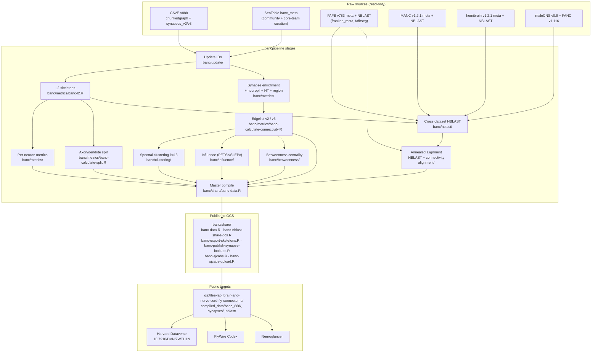

# bancpipeline

[](https://www.gnu.org/licenses/gpl-3.0)
[](https://doi.org/10.1101/2025.07.31.667571)
[](https://doi.org/10.7910/DVN/7WTH1N)

Data pre-processing pipeline for the **BANC** (Brain And Nerve Cord) connectome — the first densely-reconstructed adult fly connectome that unites brain and ventral nerve cord. This repository accompanies:

> Bates, Phelps, Kim, Yang, et al. **Distributed control circuits across a brain-and-cord connectome.** *bioRxiv* (2025). <https://doi.org/10.1101/2025.07.31.667571>

`bancpipeline` is the project's post-proofreading pipeline. It produces the analysis-ready data files released alongside the paper: skeletonization, cross-dataset neuron matching (NBLAST + connectivity), axon–dendrite splitting, neuropil assignment to synapses, neurotransmitter and metric enrichment, and consolidated per-neuron metadata. Downstream paper analyses live in the sister repository [`BANC-project`](https://github.com/htem/BANC-project); end-user data access lives in [`bancr`](https://github.com/natverse/bancr) (R) and [`banc`](https://pypi.org/project/banc/) (Python).

---

## Most users want data, not code

If you want to **use** the BANC connectome rather than rebuild it, you do not need this repository. Rather, this repo is a good reference for what was done to create data products available on our Harvard Dataverse and GCS bucket. Pick the entry point that matches your task:

| You want to… | Use |
|---|---|
| Browse neurons interactively | [FlyWire Codex](https://codex.flywire.ai/banc) |
| View the volume in 3D | [Neuroglancer](https://ng.banc.community/view) |
| Query the BANC from R | [`bancr`](https://github.com/natverse/bancr) |
| Query the BANC from Python | [`banc`](https://pypi.org/project/banc/) |
| Reproduce paper figures | [`BANC-project`](https://github.com/htem/BANC-project) |
| Download bulk data (DOI-minted) | [Harvard Dataverse 10.7910/DVN/7WTH1N](https://doi.org/10.7910/DVN/7WTH1N) |
| Download bulk data (mutable) | [GCS bucket `lee-lab_brain-and-nerve-cord-fly-connectome`](https://console.cloud.google.com/storage/browser/lee-lab_brain-and-nerve-cord-fly-connectome/) |
| View aligned EM image data | [BossDB project](https://bossdb.org/project/bates_phelps_kim_yang2025) |
| Contribute community annotations | [banc-bot](https://blog.flywire.ai/2024/12/20/banc-bot-guide/) — Slack interface open to the *Drosophila* neuroscience community since 2023 |
| Learn how to analyse fly connectome data | [`fly_connectome_data_tutorial`](https://github.com/sjcabs/fly_connectome_data_tutorial) — hands-on R + Python walkthrough from the [SJCABS](https://sjcabs.com/) winter school (San Juan Winter School on Connectomics and Brain Simulation), covering BANC, FAFB, MANC, hemibrain and maleCNS |
| Find every BANC tool + tutorial | [BANC portal](https://banc.community) |

---

## Released data products

Every data file produced by `bancpipeline` is mirrored at **both** the Harvard Dataverse (frozen, paper version) and the GCS bucket (mutable, evolves with the live project). The paper Methods references each file with the convention `[filename.feather]`; the table below maps the most-asked-for artefacts.

Per-column schemas for every file live at [`BANC-project/manuscript/print/dataverse/documentation/`](https://github.com/htem/BANC-project/tree/main/manuscript/print/dataverse/documentation).

| What | File | What it contains |
|---|---|---|
| Per-neuron metadata (188k rows × 79 cols) | `banc_888_meta.feather` | Cell-type hierarchy, region, side, neuromere, hemilineage, cross-dataset matches, NT, AN/DN cluster, CNS-network membership, morphology metrics. The headline table. |
| Per-neuron metrics | `banc_888_metrics.feather` | Cable length, volume, synapse counts, mitochondria, flow-centrality segregation index |
| Neuron-to-neuron edgelist (paper version) | `banc_888_edgelist_simple_v2.feather` | One row per ordered (pre, post) pair with `count`, `norm` (fraction of post's total input) and per-neuron totals |
| Compartment-resolved edgelist | `banc_888_edgelist_split_v2.feather` | As above, with axon / dendrite / soma / primary-dendrite labels on both sides |
| Per-synapse table (218M rows, paper version) | `banc_888_synapses_v2_enriched.parquet` | Pre/post root IDs, 3D coordinates, neuropil, region, per-synapse NT classifier output, compartment labels |
| Per-neuron neurotransmitter prediction | `banc_888_neurotransmitter_prediction_v2.csv` | Per-NT presynapse counts, argmax class, confidence |
| Cross-dataset NBLAST | `banc_{fafb_783,manc_v1.2.1,fanc_1116,hemibrain_v1.2.1,malecns_v0.9}_nblast.feather` | Pairwise scores from BANC to each reference connectome |
| Left–right NBLAST | `banc_mirror_nblast.feather` | BANC self-matched after thin-plate-spline mirror registration |
| Influence (all-to-all) | `influence/all_to_all/*.parquet` | Steady-state activation between every (source, target) neuron pair |
| Influence (effector / sensory aggregations) | `influence_all_to_effector_subclass.parquet`, `influence_sensory_subclass_to_all.parquet` | Pooled source / target variants |
| CNS networks (spectral clustering) | `banc_888_cns_network_spectral_clustering_v2.csv` | 13 graph-Laplacian clusters + UMAP coords |
| Betweenness centrality | `banc_888_betweenness_*.csv` | All-to-all and sensory→effector variants |
| Neuron meshes | `banc_neuron_meshes.zip` | One `.obj` per proofread neuron |
| L2 skeletons | `banc_swc_skeletons.zip` | One `.swc` per neuron, in BANC voxel space |
| Color MIPs (NeuronBridge format) | `banc_color_mips.zip` | Registered to JRC2018_Unisex_20x_HR and JRC2018_VNC_Unisex_40x_DS |
| Template registrations | `banc_template_spaces.zip`, `registration_brain_jrc2018f.zip`, `registration_vnc_jrc2018vncf.zip` | BANC ↔ JRC2018F / JRC2018VNCF |
| Neuropil meshes | `banc_neuropil_meshes.zip` | Closed CNS surface + per-neuropil sub-meshes |

**Versions to know:**
- Materialization `v888` (snapshot 2026-04-17) = paper version. `v626` was the preprint version (superseded; do not use).
- Synapses: `v2` (size ≥ 5) = paper version. `v3` (size ≥ 10) is provided for future work; NT predictions are still computed on `v2`. 'Size' is the size in voxels of detected postsynapses, by different detection networks. Minimum threshold determined for each by human manual review, by Aelysia Ltd.

---

## Pipeline overview

The end-to-end pipeline pulls raw CAVE outputs + SeaTable curation, builds the analysis-ready data products, and publishes them to the public GCS bucket + Harvard Dataverse. Every labelled subdirectory below is one logical stage; clicking through `banc/<stage>/` shows the per-stage R / Python scripts.



`banc/share/` is the single boundary between the internal pipeline and the public bucket — every output that ships externally is written or rsynced by a script in there. Sister-dataset publish steps (`fafb/fafb-sjcabs.R`, `hemibrain/hemibrain-sjcabs.R`, `manc/manc-sjcabs.R`, `malecns/malecns-sjcabs.R`) follow the same pattern for the cross-dataset reference deposits.

## Public GCS layout

The bucket is `gs://lee-lab_brain-and-nerve-cord-fly-connectome/` (browse at <https://console.cloud.google.com/storage/browser/lee-lab_brain-and-nerve-cord-fly-connectome/>; public, no auth needed). The Harvard Dataverse deposit at <https://doi.org/10.7910/DVN/7WTH1N> mirrors the same files at the paper-release snapshot.

```
gs://lee-lab_brain-and-nerve-cord-fly-connectome/
├── compiled_data/                          # Versioned, ready-to-analyse outputs
│   ├── banc_888/                           # ← bancpipeline's headline deposit
│   │   ├── banc_888_meta.feather           # per-neuron metadata (188k × 79 cols)
│   │   ├── banc_888_metrics.feather        # per-neuron cable / volume / counts
│   │   ├── banc_888_synapses_v2_enriched.parquet  # 218M synapses, NT + neuropil + compartment
│   │   ├── banc_888_synapses_v3_enriched.parquet  # v3 variant (future work)
│   │   ├── banc_888_edgelist_simple_v2.feather    # paper edgelist, size ≥ 5
│   │   ├── banc_888_edgelist_simple_v3.feather    # v3 variant, size ≥ 10
│   │   ├── banc_888_edgelist_split_v2.feather     # compartment-resolved edgelist
│   │   ├── banc_888_neurotransmitter_prediction_v2.csv
│   │   ├── banc_888_cns_network_spectral_clustering_v2.csv   # 13 CNS networks
│   │   ├── banc_888_betweenness_all_to_all_v2.csv
│   │   ├── banc_888_betweenness_afferent_to_efferent_v2.csv
│   │   ├── banc_<dataset>_<ver>_nblast.feather    # cross-dataset NBLAST (5 references + mirror)
│   │   ├── banc_banc_space_swc/{root_id}.swc      # L2 skeletons (also zipped)
│   │   └── influence/all_to_all/chunk_*.parquet   # all-to-all influence shards
│   ├── fafb_783/                           # FAFB reference deposit (fafb/fafb-sjcabs.R)
│   ├── hemibrain_121/                      # hemibrain reference (hemibrain/hemibrain-sjcabs.R)
│   ├── manc_121/                           # MANC reference (manc/manc-sjcabs.R)
│   └── malecns_09/                         # maleCNS reference (malecns/malecns-sjcabs.R)
├── synapses/v{2,3}/                        # per-version raw synapse + NT-classifier parquets
├── neuron_connectivity/v888/               # human-readable CAVE synapse exports
├── neuron_annotations/v888/                # CAVE-derived annotation parquets
└── nblast/                                 # shared NBLAST result feathers
```

Per-file schemas (column-by-column) live at [`BANC-project/manuscript/print/dataverse/documentation/`](https://github.com/htem/BANC-project/tree/main/manuscript/print/dataverse/documentation) — one `.md` per file in the deposit. The full producer ↔ output map is in [`docs/data-products.md`](docs/data-products.md); storage paths + their `banc-startup.R` env vars are in [`docs/data-layout.md`](docs/data-layout.md).

## Matching process: raw morphology → cell-type assignment

Cell-type assignment in the BANC is the result of a four-stage chain — registration (put each neuron into a common space), bridging (move meshes between datasets), NBLAST (rank candidate matches by morphological similarity), and either the **annealed alignment algorithm** (paper Methods §"Automated typing by morphology and connectivity") or the **manual PNG-review pipeline** (historical, paper-era; superseded for cell-typing but still produced the `INVESTIGATE` / `TRACING_ISSUE` / `NO_*_MATCH` tags in the released metadata).

```mermaid
flowchart LR
    subgraph RAW["Raw morphology"]
        BANC_MESH["BANC neuron meshes<br/>banc/metrics/banc-obj.R"]
        BANC_L2["BANC L2 skeletons<br/>banc/metrics/banc-l2.R"]
        REF_MESH["Reference dataset meshes<br/>(FAFB, MANC, FANC,<br/>hemibrain, maleCNS)"]
    end

    subgraph REG["Registration"]
        ELASTIX["elastix: BANC ↔ JRC2018F / JRCVNC2018F<br/>banc/transforms/<br/>(synapse-density-driven)"]
    end

    subgraph BRIDGE["Bridging"]
        BRIDGE_OP["bancr::*_transform()<br/>banc/transforms/banc-{fafb,manc,fanc,hemibrain,malecns}-{mesh,skel}-transform.R"]
    end

    subgraph NBLAST_STAGE["NBLAST"]
        DOTPROPS["dotprops in BANC space<br/>banc/nblast/banc-make-proofread-ids.R"]
        NBSCORE["Pairwise NBLAST<br/>banc/nblast/banc-{fafb,manc,fanc,hemibrain,malecns}-nblast.R<br/>+ left-right mirror"]
        COMPILE["Compile + dedupe<br/>banc/nblast/banc-nblast-compile.R"]
    end

    subgraph DECIDE["Cell-type decision"]
        ALIGN_RUN["Annealed alignment<br/>NBLAST + connectivity ensemble<br/>α: 0.05 → 0.95 over 80 iter<br/>alignment/banc-alignment-run.py"]
        PNG_REVIEW["Manual PNG review<br/>banc/nblast/banc-*-nblast-images.R<br/>+ matcher workflow<br/>(historical; see docs/png-matching.md)"]
    end

    subgraph PUSH["SeaTable curation"]
        SEATABLE["SeaTable banc_meta<br/>cell_type / super_class / fafb_match / etc.<br/>banc/update/ + banc/matching/"]
    end

    BANC_MESH --> ELASTIX
    BANC_L2 --> ELASTIX
    REF_MESH --> ELASTIX
    ELASTIX --> BRIDGE_OP
    BRIDGE_OP --> DOTPROPS
    DOTPROPS --> NBSCORE
    NBSCORE --> COMPILE
    COMPILE --> ALIGN_RUN
    COMPILE --> PNG_REVIEW
    ALIGN_RUN --> SEATABLE
    PNG_REVIEW --> SEATABLE
```



The **annealed alignment** is the paper-published cell-typing method (full algorithm in [`alignment/README.md`](alignment/README.md) — 82.7 % holdout accuracy on right optic lobe vs 43.9 % NBLAST-only / 65.0 % NTAC). The **manual PNG-review pipeline** is documented as a historical reference in [`docs/png-matching.md`](docs/png-matching.md); its outputs (the per-target `correct/` directories) seeded the alignment algorithm's anchor labels.

---

## Algorithm spotlight: cross-dataset cell-typing by annealed morphology + connectivity

Most of `bancpipeline` is bookkeeping. The flagship algorithmic contribution lives in [`alignment/`](alignment/README.md) and solves a notoriously hard problem: **cross-connectome cell-type transfer where neither morphology nor connectivity alone is sufficient**.

### High-level overview

NBLAST (morphology only) fails for columnar visual types and look-alike interneurons; NTAC (connectivity only, within-graph) needs dense seeding and degrades on partial graphs. Human annotators resolve the ambiguous cases by considering morphology first then refining with connectivity. We formalise that two-stage reasoning into an iterative algorithm that **anneals between the two signals**: each iteration scores every query neuron against every target cell-type centroid as a weighted blend of connectivity similarity and NBLAST similarity, and the blend is rebalanced from morphology-dominant (early) to connectivity-dominant (late). The algorithm is dataset-agnostic — the paper run aligns BANC (query) ↔ FAFB (target), but any pair of densely-reconstructed connectomes that share a cell-type vocabulary slots in.

### How it works, in five steps

1. **Prep.** Filter both connectomes to the same neuron pool (region preset). Build a 3-tier seed table — Tier 1: query neurons with a known cell-type are anchored; Tier 2: query neurons with a strong NBLAST match are initialised to that target type; Tier 3: everything else starts unassigned. Compute a per-type capacity from target left–right count variability + 10 % slack.
2. **Fixed target centroids.** Each target cell-type gets a mean connectivity profile — concatenated input + output type-by-type weights, 1-hop *and* 2-hop. These are computed once and held fixed.
3. **Iterate** (80 passes). Each iteration:
   - Build current query type-connectivity profiles from the current assignment.
   - Score every non-anchor query neuron against every target type as
     `score = α · connectivity_similarity + (1 − α) · NBLAST_similarity`
     where connectivity_similarity is a **cosine-seeded weighted-Jaccard ensemble** (cosine pre-ranks the top-30 candidates, weighted Jaccard re-ranks them) and `α` is annealed `0.05 → 0.95` while softmax temperature `τ` is annealed `4.0 → 0.5` in parallel.
   - Convert soft scores to hard types via **capacity-constrained greedy assignment**: each FAFB neuron can anchor at most one BANC match, and per-type assignment counts are capped at capacity. A curated false-positive list (~1,125 known-bad NBLAST matches) and a soma-presence rule (no nucleated neuron → photoreceptor / lamina type) act as side constraints.
4. **Early-stop on holdout accuracy.** Keep the iteration with the best holdout score.
5. **Validate.** Score the held-out intrinsic-neuron assignments against their ground-truth labels; check that the predicted NT matches the assigned type's NT consensus; flag mismatches against existing SeaTable annotations.

The schedule is the key idea: starting morphology-balanced gives the algorithm a sane anchor, and ramping toward connectivity-dominant lets it refine the columnar / interneuron ambiguities that morphology alone can't resolve. Full algorithm doc, parameter rationales and ablations: [`alignment/README.md`](alignment/README.md) and [`alignment/experiment-log.md`](alignment/experiment-log.md). Paper Methods §"Automated typing by morphology and connectivity".

### Headline result (BANC right optic lobe)

| Method | Holdout accuracy |
|---|---|
| NBLAST-only baseline | 43.9 % |
| NTAC (within-dataset, ≤9 % seeds) | 65.0 % |
| **This algorithm** | **82.7 %** (Mi1 anchor type: 90.4 %) |

Spearman correlation between BANC and FAFB per-type neuron counts: **0.938**.

### Running it from the released data

The released GCS artefacts contain the edgelists + NBLAST inputs the algorithm needs; `--source gcs` fetches them on demand. The only HMS-account requirement is that **the prep stage queries the BANC SeaTable for live metadata** — populate `data/private/keys.csv` (see [`banc/load-keys.R`](banc/load-keys.R)) before running, or stub `banctable_query()` for a fully offline run.

```bash
# Install bancpipeline (just the source — no compute at install time)
git clone https://github.com/htem/bancpipeline.git
cd bancpipeline

# Stage 1: prep — auto-fetches BANC + FAFB edgelists and NBLAST from GCS
Rscript alignment/banc-alignment-prep.R --region optic-lobe right --source gcs --syn-source v2

# Stage 2: run — paper-config parameters
python alignment/banc-alignment-run.py \
  --side right --metric ensemble --max-iter 80 \
  --hop2-weight 1.0 --nblast-threshold 0.15 \
  --tau-start 4.0 --alpha-start 0.05 --alpha-end 0.95 \
  --ensemble-blend 0.3 --manual-labels Mi1 --nt-weight 0

# Stage 3: validate — holdout accuracy + NT consistency + mismatch report
Rscript alignment/banc-alignment-validate.R right
```

Outputs land in `data/optic_lobe/`: `banc_optic_right_alignment.csv`, `banc_optic_right_holdout_accuracy.csv`, `banc_optic_right_nt_mismatches.csv`, `banc_optic_right_mismatches.csv`.

To align a different region: copy `alignment/presets/optic-lobe/` to `alignment/presets/<your-region>/`, edit the filter spec inside `prep.R`, and pass `--region <your-region>` to the prep step above. See [`alignment/README.md`](alignment/README.md#presets) for the full recipe.

---

## Repository layout

```
bancpipeline/
├── banc/
│   ├── banc-startup.R          # paths, libraries, helpers; sourced by every script
│   ├── banc-functions.R        # shared utilities
│   ├── meta/                   # banc-meta.R, banc-data.R — master tables + Dataverse exports
│   ├── metrics/                # L2 skeletons, regions, synapses, split, volumes
│   ├── nblast/                 # cross-dataset and mirror NBLAST
│   ├── clustering/             # CNS-network spectral clustering
│   ├── influence/              # all-to-all influence scoring
│   ├── matching/               # cross-validation of NBLAST matches
│   ├── transforms/             # cross-dataset mesh/skeleton registration
│   ├── update/                 # SeaTable read/write
│   ├── annotations/            # cell-type curation utilities
│   ├── utilities/              # plotting, conversion, QC
│   └── legacy/                 # archived; kept for paper-reproducibility cross-references
├── alignment/                  # cross-dataset cell-type transfer (flagship algorithm)
├── o2/                         # SLURM batch scripts (HMS-O2 specific)
├── fafb/, fanc/, hemibrain/, malecns/, manc/, deform/  # sister-dataset pipelines
├── setup/                      # one-time environment setup
├── docs/                       # this README's longer companions
└── inst/                       # static assets referenced by scripts
```

---

## Re-running the pipeline

The pipeline was developed on **Harvard Medical School's O2 HPC cluster** (Slurm). Re-execution requires:

- HMS O2 affiliation (login + Slurm submission rights).
- A CAVE token with read access to the BANC dataset.
- SeaTable credentials for the project's annotation database.
- The R / Python module environment defined in [`o2/o2_env.sh`](o2/o2_env.sh).
- Substantial compute: several days of cluster time for a full rebuild from raw CAVE outputs.

If you are HMS-affiliated and want to re-run a stage, start at [`docs/pipeline.md`](docs/pipeline.md) and [`docs/o2-setup.md`](docs/o2-setup.md) (added during the paper-release pass). If you are not HMS-affiliated, the released data products listed above contain every output the pipeline produces — you do not need to re-execute it.

---

## Citation

If you use `bancpipeline` outputs, please cite the paper:

```bibtex
@article{bates2025banc,
  title   = {Distributed control circuits across a brain-and-cord connectome},
  author  = {Bates, Alexander S. and Phelps, Jasper S. and Kim, Minsu and Yang, Helen H. and others},
  journal = {bioRxiv},
  year    = {2025},
  doi     = {10.1101/2025.07.31.667571}
}
```

Bulk data (this pipeline's outputs) carries its own DOI: <https://doi.org/10.7910/DVN/7WTH1N>.

## License

GPL-3 — see [`LICENSE`](LICENSE).

## Acknowledgements

This codebase was led by [Alexander Shakeel Bates](https://scholar.google.com/citations?user=BOVTiXIAAAAJ&hl=en) in the lab of [Rachel Wilson](https://neuro.hms.harvard.edu/faculty-staff/rachel-wilson) at Harvard Medical School, and working with [Wei-Chung Allen Lee](https://www.lee.hms.harvard.edu/). `bancpipeline` was developed by the BANC consortium under the leadership of the Wilson Lab (HMS) and the Lee Lab (Princeton, GitHub org [`htem`](https://github.com/htem)), with contributions from the FlyWire and CAVE teams. EM proofreading was performed by SixEleven (Davao City, Philippines), Aelysia LTD (Bristol, UK), and a community of academic neurobiologists and citizen scientists.

### Computing infrastructure

This work was performed on the [O2 High-Performance Compute Cluster](https://harvardmed.atlassian.net/wiki/spaces/O2/overview?homepageId=1586790623), supported by the Research Computing Group of the Department of Information Technology at Harvard Medical School. We are grateful to HMS Research Computing — in particular the O2 user-support team — for cluster access, the SLURM scheduling and LMOD module infrastructure, the Lustre storage that holds the connectome working set, and ongoing technical guidance throughout the project. The full v888 release pipeline (synapse enrichment, edgelists, NBLAST, the all-to-all influence solve, and the cross-dataset alignment) was produced end-to-end on O2; details of how the pipeline schedules its jobs there are in [`o2/README.md`](o2/README.md) and the "HMS O2" section of [`requirements.txt`](requirements.txt).

### Funding

Supported by NIH (R01NS121874, RF1MH117808, U19NS118246, U24NS126935, RF1MH117815, and individual investigator grants), HHMI (R.I.W. is an HHMI Investigator), the Wellcome Trust (Sir Henry Wellcome Postdoctoral Fellowship 222782/Z/21/Z to A.S.B.), the W.M. Keck Foundation, and the HMS O2 High-Performance Compute Cluster. Full funding attribution, including individual fellowships, is in the [paper Acknowledgements](https://doi.org/10.1101/2025.07.31.667571).

This pipeline is built on the [natverse](https://natverse.org) ecosystem ([`nat`](https://github.com/natverse/nat), [`nat.nblast`](https://github.com/natverse/nat.nblast), [`hemibrainr`](https://github.com/natverse/hemibrainr), [`bancr`](https://github.com/natverse/bancr), [`fafbseg`](https://github.com/natverse/fafbseg), [`malevnc`](https://github.com/natverse/malevnc)) and the [navis](https://navis.readthedocs.io/) / [CAVEclient](https://github.com/CAVEconnectome/CAVEclient) / [pcg_skel](https://github.com/CAVEconnectome/pcg_skel) Python toolchain. We are grateful to those projects' maintainers.
